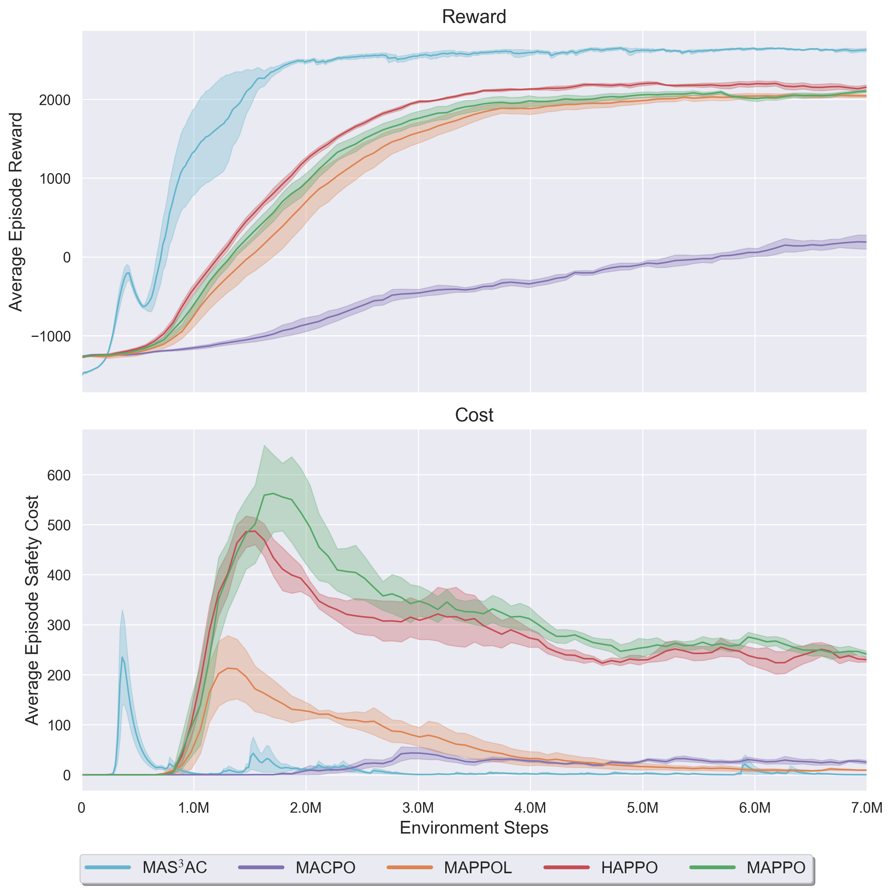
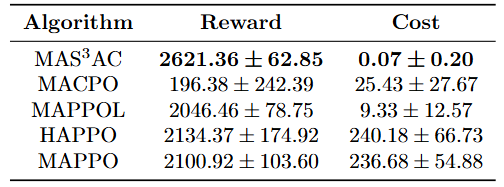
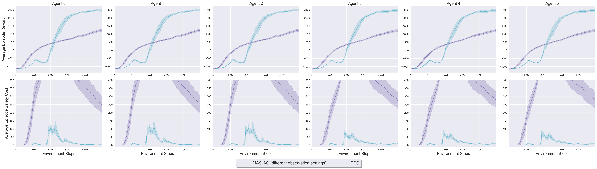
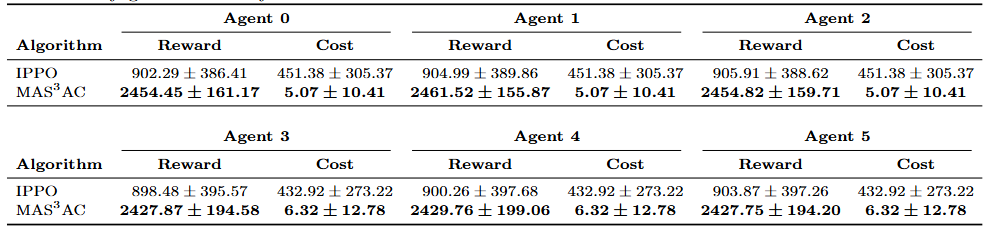
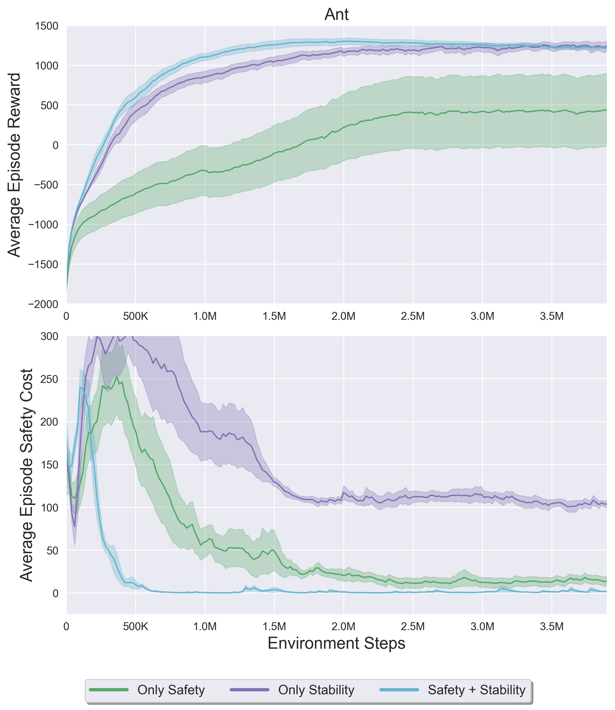
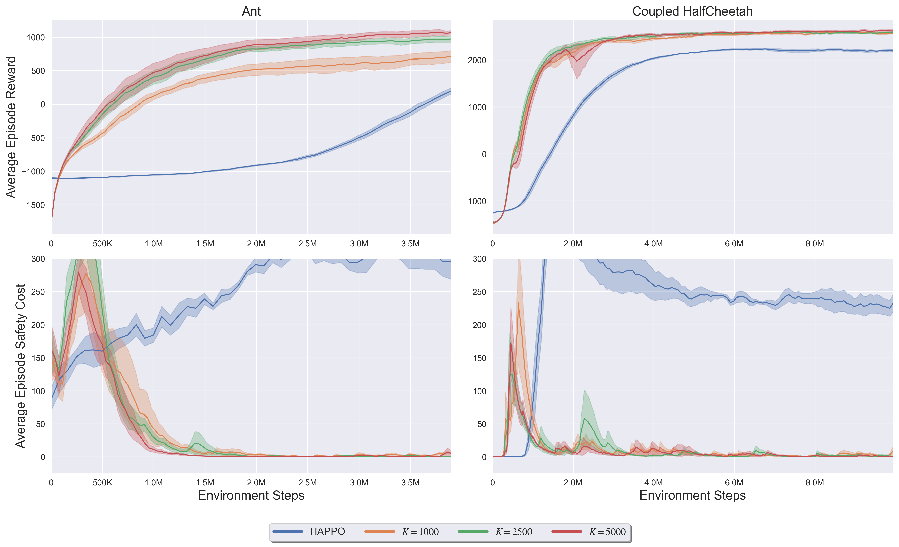
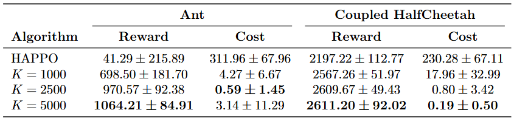

## Figure 1. Reward and safety cost comparison for the modified Coupled HalfCheetah task.

## Table 1. Reward and safety cost comparison for the modified Coupled HalfCheetah task.

## Figure 2. Decentralized Coupled HalfCheetah task with neither fully global nor fully local observations.

## Table 2: Reward and safety cost comparison for the non-cooperative Coupled HalfCheetah task with neither fully global nor fully local observations

## Figure 3. Reward and safety cost comparison when using only safety constraint, only stability constraint, and both safety and stability constraints.

## Figure 4. Reward and safety cost comparison for two tasks with different K values for learning rate design.

## Table 3: Reward and safety cost comparison for two tasks with different K values for learning rate design

